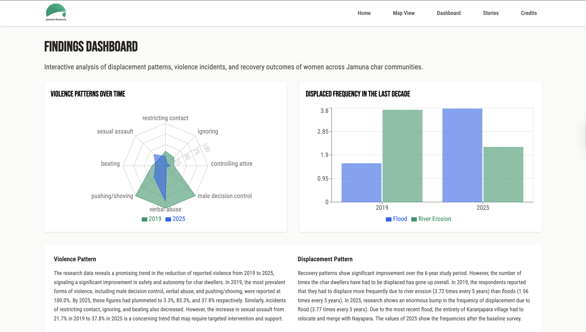
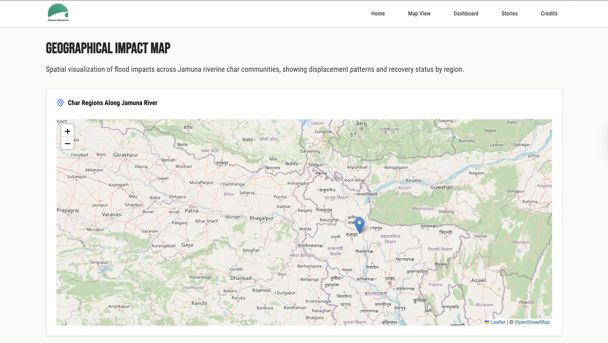

# Jamuna Atlas

An interactive web platform to visualize the impact of the Martin Scholarship fieldwork conducted in the Jamuna Riverine region. Built with a full-stack JavaScript stack: React (Vite) on the frontend and Express on the backend.

## Project Overview

This site was built to:

- Display interactive charts, maps, and visuals from field data collected in Bangladesh's char communities.
- Present key insights related to displacement, housing, income, violence, and more.
- Amplify underrepresented voices through data-driven storytelling.

## Tech Stack

| Layer       | Technology          |
|-------------|---------------------|
| Frontend    | React + Vite        |
| Styling     | Tailwind CSS        |
| Backend     | Node.js + Express   |
| Database    | MySQL               |
| Charts      | Recharts            |
---

### Prerequisites

- Node.js (v18+ recommended)
- MySQL (or alternative DB)
- `.env` file in `server/` with your credentials
- Data will be visible once the database has been hosted online. For now, I am running this locally.

### 📦 Install & Run

1. Clone the repository:

   ```
   git clone https://github.com/priom-mahatab/martin-scholarship.git
   cd martin-scholarship
   ```

2. Start the frontend:

    ```
    cd client
    npm install
    npm run dev
    ```

3. Start the backend:

    ```
    cd server
    npm install
    nodemon index.mjs
    ```

### Preview of the website

-
-
-


